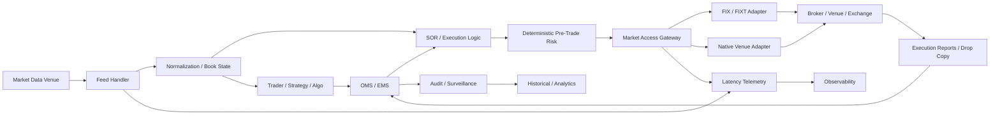

# I01 — Reference Architecture

## Logical view

## Architectural planes

### 1. Execution hot path
Latency-sensitive:
- market-access gateway;
- venue protocol adapter;
- deterministic risk checks;
- routing decisions that must meet strict latency budgets;
- time synchronization and high-resolution telemetry.

### 2. Near path
Latency-aware but not necessarily colocated:
- OMS/EMS;
- reference data;
- aggregated risk;
- operational control services;
- drop copy processing;
- reconciliation.

### 3. Elastic / enterprise plane
Good candidates for cloud or shared platforms:
- historical analytics;
- reporting;
- data science;
- model training;
- non-real-time risk;
- observability backends;
- CI/CD;
- archive and compliance data.

## Key boundaries

### Gateway boundary
The Market Access Gateway owns:
- venue session state;
- protocol serialization/deserialization;
- sequence and recovery state;
- order throttling;
- deterministic pre-trade checks delegated or embedded by policy;
- operational kill switch;
- latency timestamps.

It must not become a general-purpose integration bus.

### Event-streaming boundary
Kafka-compatible event streaming is valuable for:
- audit;
- downstream analytics;
- replay pipelines;
- telemetry;
- post-trade integration.

It is not assumed to be the synchronous order hot path.

## Design drivers

- deterministic latency over average throughput;
- bounded jitter;
- fail-safe controls;
- replay and recovery;
- observability without excessive hot-path overhead;
- independent venue adapters;
- explicit placement decisions;
- progressive migration instead of wholesale cloud relocation.
