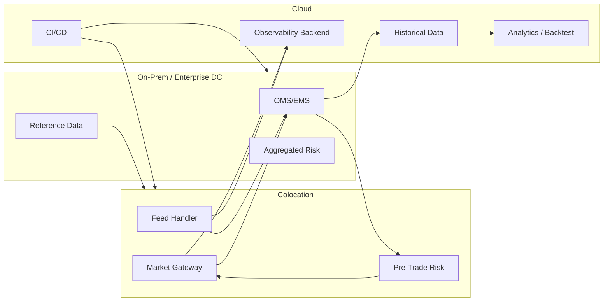

# I06 — Colocation / On-Prem / Cloud Placement

## Decision principle

Place workloads according to latency sensitivity, data gravity, resilience, security and operational constraints.

| Capability | Colocation | On-prem | Cloud |
|---|---|---|---|
| Venue gateway | Preferred for strict latency | Possible | Usually not hot-path default |
| Native protocol adapter | Preferred | Possible | Generally avoid for strict latency |
| Deterministic pre-trade checks | Often near gateway | Yes | Only if latency budget permits |
| OMS/EMS | Possible | Strong fit | Possible depending on NFR |
| Reference data | Cache locally | System of record possible | Good distribution/source option |
| Historical market data | Cache subset | Possible | Strong fit |
| Analytics / backtest | Limited | Possible | Strong fit |
| Observability backend | Local edge collector | Yes | Strong fit |
| CI/CD | No need | Yes | Strong fit |
| Model training | No need | Possible | Strong fit |

## Hybrid pattern

## Migration sequencing

1. inventory current applications and venue dependencies;
2. classify workloads by latency criticality;
3. baseline latency and throughput;
4. separate hot path from enterprise integration;
5. rationalize protocols/adapters;
6. move analytics/observability/data workloads first;
7. modernize near-path components;
8. change hot-path placement only with measured evidence.

## Anti-pattern

"Cloud-first" must not be translated into "move every trading component to cloud".

The architect must make the latency boundary explicit.
