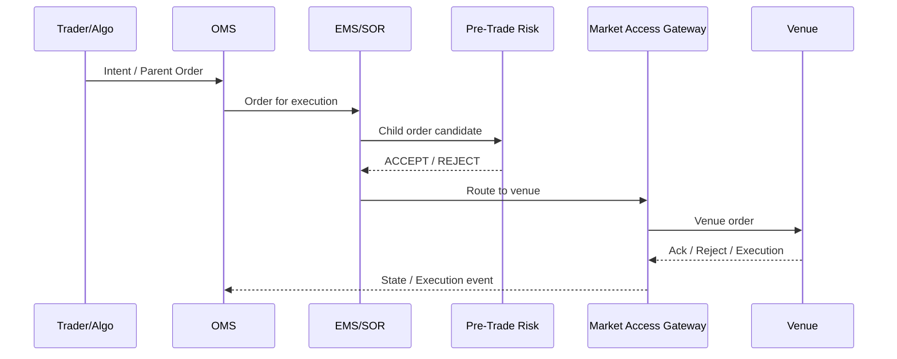

# I01 — Frontières OMS, EMS, SOR, Algo et Gateway

## Objectif

Éviter les confusions de responsabilité entre composants.

## OMS — Order Management System

Responsabilités typiques :
- capturer et maintenir l'ordre ;
- porter l'état métier de l'ordre ;
- gérer les identifiants et corrélations ;
- transmettre l'ordre vers l'exécution ;
- recevoir les états d'exécution ;
- conserver l'historique et supporter la réconciliation.

L'OMS n'est pas automatiquement le composant qui choisit la meilleure venue en temps réel.

## EMS — Execution Management System

Responsabilités typiques :
- organiser l'exécution d'un ordre ;
- fournir des fonctions de pilotage au trader ;
- dialoguer avec algos, brokers et destinations ;
- gérer stratégies d'exécution, child orders et suivi de performance.

## Algo engine

Un algo peut :
- découper un parent order ;
- choisir des timings ;
- adapter quantités/prix ;
- réagir à la Market Data ;
- produire plusieurs child orders.

Il ne doit pas pouvoir contourner les contrôles déterministes obligatoires.

## SOR — Smart Order Router

Responsabilités typiques :
- comparer destinations admissibles ;
- appliquer règles de routing ;
- tenir compte prix, liquidité, coûts, disponibilité et politiques ;
- produire une décision de venue.

Le SOR ne doit pas être confondu avec le protocole de connectivité.

## Pre-Trade Risk

Responsabilités :
- vérifier que l'ordre respecte les limites avant envoi ;
- retourner ACCEPT / REJECT avec un motif traçable ;
- fonctionner avec des politiques déterministes ;
- rester compatible avec kill functionality et procédures dégradées.

## Market Access Gateway

Responsabilités typiques :
- présenter un contrat interne stable ;
- sérialiser vers FIX/FIXT ou un protocole natif ;
- gérer sessions, identifiants et états de connectivité ;
- appliquer throttling et contrôles proches de la venue ;
- tracer les timestamps critiques ;
- assurer recovery et fail-safe selon design.

## Vue de séquence logique

## Règle d'architecture

Le contrat interne doit permettre de changer d'adapter de venue sans propager les détails du protocole dans l'OMS ou dans toute l'entreprise.

## Questions d'entretien

- Qui est source de vérité de l'état d'ordre ?
- Où vit l'identifiant client et où vit l'identifiant venue ?
- Le SOR est-il centralisé ou embarqué dans l'EMS ?
- Les contrôles pré-trade sont-ils centralisés, dupliqués ou embarqués ?
- Qui possède le kill switch ?
- Quelle partie peut continuer en mode cancel-only ?
