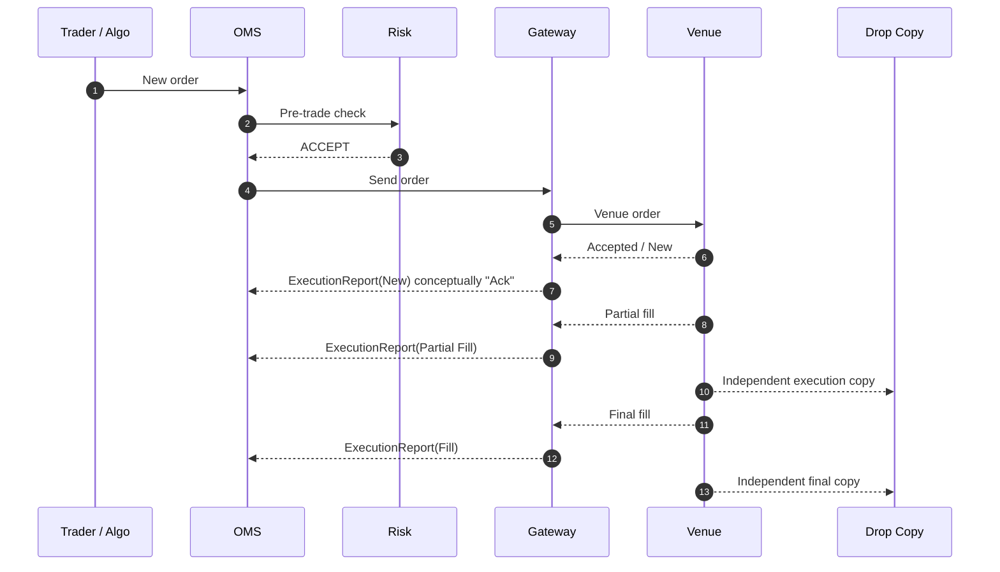

# I01 — Cycle de vie de l'ordre : happy path

## Objectif

Comprendre le cycle ordre -> acknowledgement -> exécution sans confondre message technique et état métier.

## Happy path simplifié



## Note importante sur "Ack"

Dans le vocabulaire métier, on parle souvent d'**acknowledgement**. Dans un flux FIX, l'accusé métier d'un nouvel ordre est généralement matérialisé par un **Execution Report** indiquant l'état correspondant. I01 utilise donc "Ack" comme concept, pas comme nom universel d'un message distinct.

## Quantités à suivre

- **OrderQty** : quantité initiale.
- **CumQty** : quantité cumulée exécutée.
- **LeavesQty** : quantité restant à exécuter.
- **LastQty** : quantité de la dernière exécution.

Invariant métier attendu :

```text
CumQty + LeavesQty = OrderQty
```

sous réserve des règles de remplacement/correction applicables au workflow.

## États métier simplifiés

```text
PENDING_NEW
    |
    v
NEW
    |
    +--> PARTIALLY_FILLED
    |        |
    |        +--> PARTIALLY_FILLED
    |        |
    |        +--> FILLED
    |
    +--> FILLED
```

Branches terminales possibles : REJECTED, CANCELED, EXPIRED selon cas.

## Identifiants

Minimum à corréler :
- client order ID ;
- internal order ID ;
- parent order ID si applicable ;
- child order ID ;
- venue order ID ;
- execution ID ;
- session/venue ;
- timestamps à chaque frontière.

## Pourquoi la corrélation est critique

Sans corrélation fiable :
- un fill peut être rattaché au mauvais child order ;
- une demande d'annulation peut viser un état déjà dépassé ;
- la Drop Copy ne peut pas être réconciliée ;
- un kill switch sélectif ne peut pas retrouver tous les ordres concernés.

## Critère oral

Pouvoir raconter ce scénario de bout en bout en distinguant :
- état de l'ordre ;
- message reçu ;
- exécution ;
- quantité cumulée/restante ;
- identifiants client et venue.
