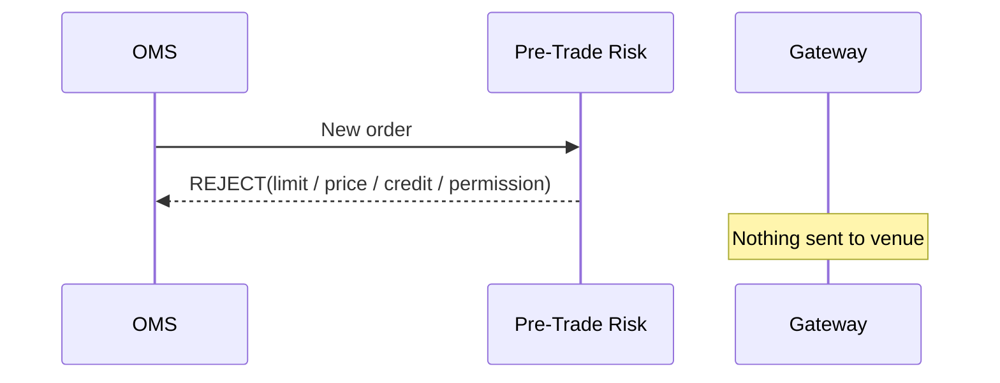
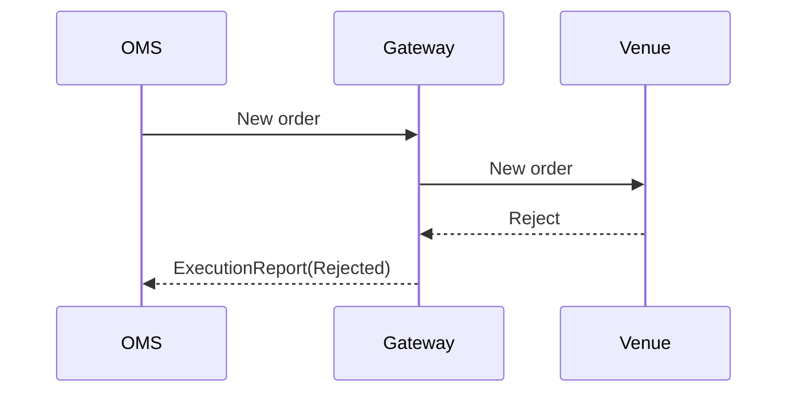
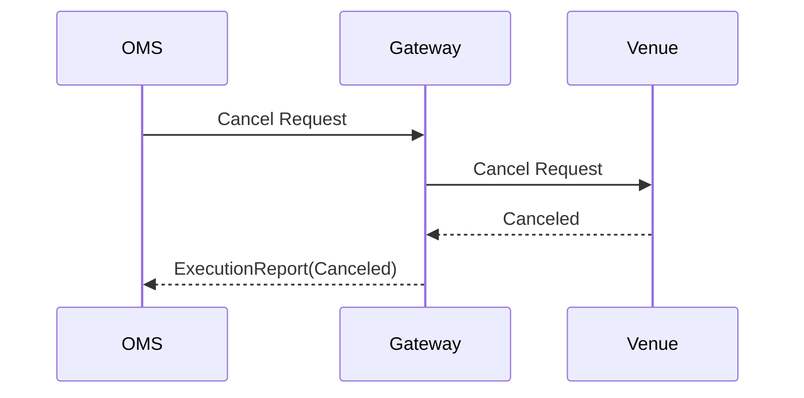
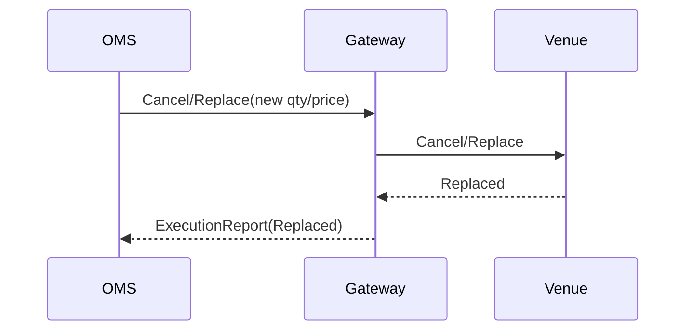
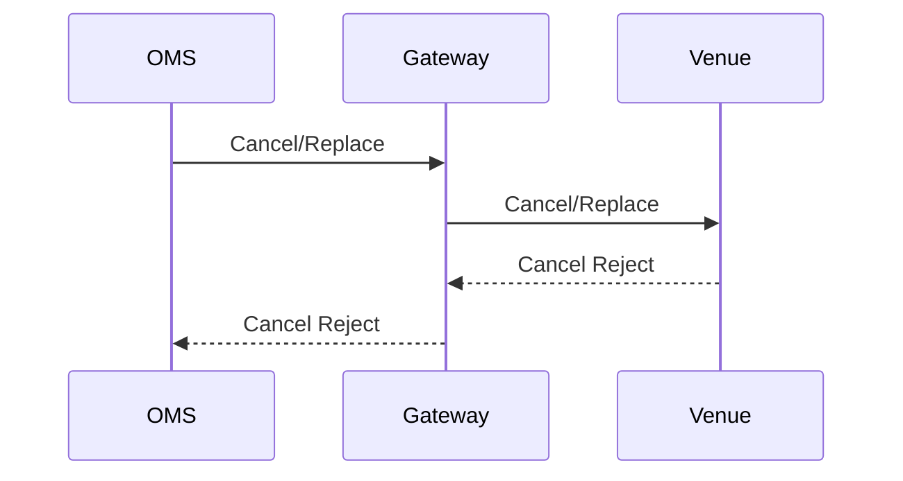

# I01 — Reject, Cancel et Cancel/Replace

## 1. Rejet avant venue



Le rejet doit conserver :
- contrôle déclenché ;
- règle/version ;
- valeur mesurée ;
- seuil ;
- horodatage ;
- identité de l'ordre.

## 2. Rejet par la venue



Le motif doit rester exploitable jusqu'à l'OMS et l'audit.

## 3. Cancel normal



## 4. Cancel/Replace

Le Cancel/Replace n'est pas une mutation locale triviale. Il constitue une demande adressée à une contrepartie/venue sur un ordre déjà actif.



## 5. Cancel Reject



Causes possibles selon contexte :
- ordre inconnu ;
- ordre déjà rempli ;
- ordre déjà annulé ;
- état incompatible ;
- identifiant invalide ;
- règles de venue.

## 6. Course Cancel vs Fill

Scénario critique :

```text
t0 order = NEW
t1 cancel request sent
t2 venue executes remaining quantity
t3 fill arrives
t4 cancel reject arrives because order is already FILLED
```

Le système doit accepter cette réalité : un **CANCEL_PENDING n'est pas une garantie que l'ordre sera annulé**.

## Règle de conception

L'OMS ne doit jamais mettre définitivement l'ordre à CANCELED au seul motif qu'il a émis une demande d'annulation.

## Critère oral

Pouvoir expliquer :
- pourquoi un cancel peut échouer ;
- pourquoi un fill peut croiser un cancel ;
- pourquoi le state machine doit intégrer les événements asynchrones ;
- pourquoi Cancel Reject n'est pas équivalent à Order Reject.
