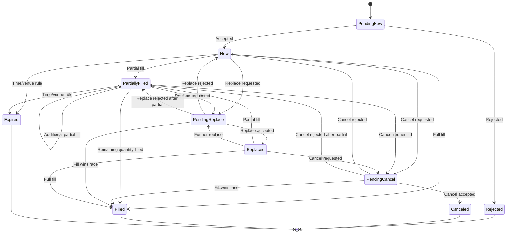

# I01 — Machine à états simplifiée de l'ordre

## Machine de référence



## État UNKNOWN / RECONCILIATION_REQUIRED

Il s'agit d'un état opérationnel local utile lorsque l'état réel côté venue n'est pas fiable ou complètement connu :

```text
LOCAL_UNKNOWN
   -> query / drop copy / session recovery / operator reconciliation
   -> authoritative state restored
```

Ce n'est pas un statut universel FIX imposé ; c'est un état d'architecture pour empêcher une reprise aveugle.

## Invariants

- Un ordre FILLED ne doit pas accepter de nouvelle quantité exécutable.
- Un ordre CANCELED ne doit plus produire de fill normal, sauf événement tardif déjà produit avant l'annulation et nécessitant réconciliation.
- Toute transition doit être traçable à un événement.
- Une transition locale ne doit pas inventer un état venue non confirmé.
- Les quantités doivent rester cohérentes avec les exécutions reçues.

## Autorité de l'état

La source de vérité dépend de l'architecture. La machine locale doit cependant être capable de distinguer :
- état **souhaité** par l'application ;
- état **envoyé** ;
- état **confirmé par la venue** ;
- état **observé indépendamment** via Drop Copy ;
- état **réconcilié**.

## Critère oral

Dessiner cette machine de mémoire en expliquant au moins :
- PendingNew ;
- New ;
- PartiallyFilled ;
- Filled ;
- PendingCancel ;
- Canceled ;
- PendingReplace ;
- Replaced ;
- Rejected ;
- Unknown/Reconciliation.
