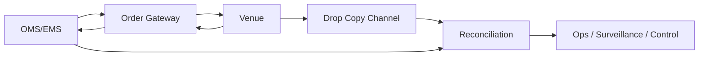

# I01 — Drop Copy et réconciliation

## Définition

Une **Drop Copy** fournit une copie indépendante d'événements d'ordres et/ou d'exécutions. Son objectif est le contrôle, la surveillance, le rapprochement et parfois l'alimentation de fonctions aval.

Elle ne remplace pas automatiquement le flux principal d'exécution.

## Vue logique

## Cas d'usage

- confirmer qu'une exécution reçue sur le canal principal est aussi observée indépendamment ;
- détecter une exécution absente de l'OMS ;
- détecter un doublon ou un état incohérent ;
- reconstruire l'état après incident ;
- alimenter surveillance/compliance selon architecture ;
- contrôler des flux de plusieurs gateways.

## Clés de rapprochement

Selon le protocole et la venue :
- venue order ID ;
- client order ID ;
- execution ID ;
- instrument ;
- side ;
- price ;
- quantity ;
- event timestamp ;
- session/venue ;
- account/client/trader/algo.

## Types d'écart

| Écart | Risque | Action |
|---|---|---|
| Fill Drop Copy absent du flux principal | position/risque faux | bloquer/reconcilier |
| Fill principal absent de Drop Copy | problème canal DC ou mapping | investiguer |
| Quantités divergentes | state corruption | geler l'ordre |
| Identifiant inconnu | orphan execution | escalade immédiate |
| Événement dupliqué | double comptage | idempotence/dedup |
| Timestamps incohérents | causalité douteuse | vérifier time sync |
| Ordre actif localement mais terminal via DC | ordre fantôme | corriger + contrôler |

## Réconciliation

Étapes possibles :
1. geler les actions risquées ;
2. comparer flux principal, Drop Copy et état local ;
3. déterminer l'événement faisant autorité ;
4. mettre à jour l'état local ;
5. documenter l'écart ;
6. reprendre uniquement lorsque l'incertitude est levée.

## Principe de sécurité

Si l'état d'un ordre est ambigu, le comportement par défaut doit privilégier la prévention d'un nouvel envoi dangereux : mode cancel-only, suspension de route, kill sélectif ou réconciliation manuelle selon le cas.

## Critère oral

Pouvoir répondre :
- pourquoi la Drop Copy est utile alors que le gateway renvoie déjà des Execution Reports ;
- comment elle aide après une perte de session ;
- ce qu'on fait lorsqu'elle contredit l'état local.
